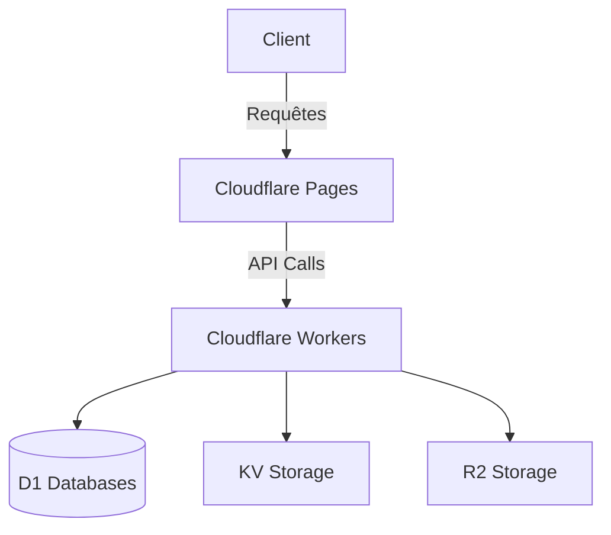

# Architecture de FloDrama

## Vue d'Ensemble

FloDrama est une application moderne de streaming construite avec une architecture serverless sur Cloudflare.

## Composants Principaux

### Frontend
- **Framework** : React avec Vite
- **UI** : Chakra UI
- **Gestion d'état** : React Query
- **Hébergement** : Cloudflare Pages

### Backend
- **Runtime** : Cloudflare Workers
- **Bases de données** :
  - `flodrama-db` : Base de données principale
  - `flodrama-streaming` : Données de streaming
- **Stockage** :
  - KV Namespaces pour le cache et les métadonnées
  - R2 pour le stockage des médias

### Services
- **Authentification** : Gestion des utilisateurs et des sessions
- **Médias** : Gestion du contenu vidéo
- **Recherche** : Indexation et recherche de contenu

## Flux de Données

